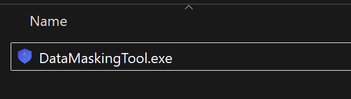
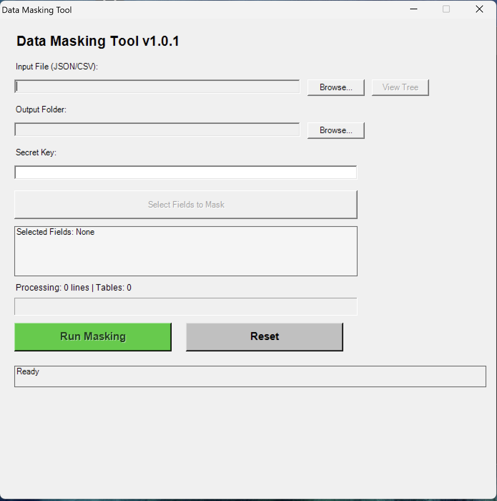
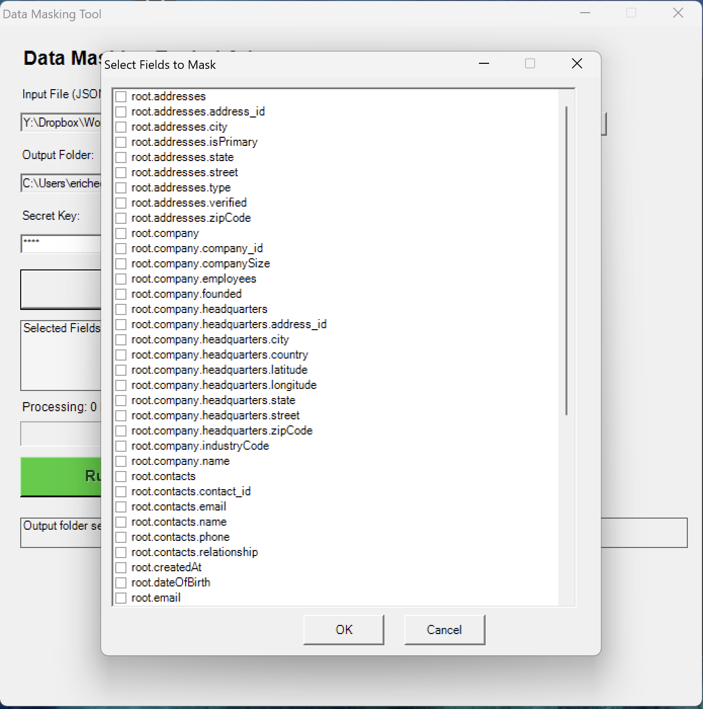
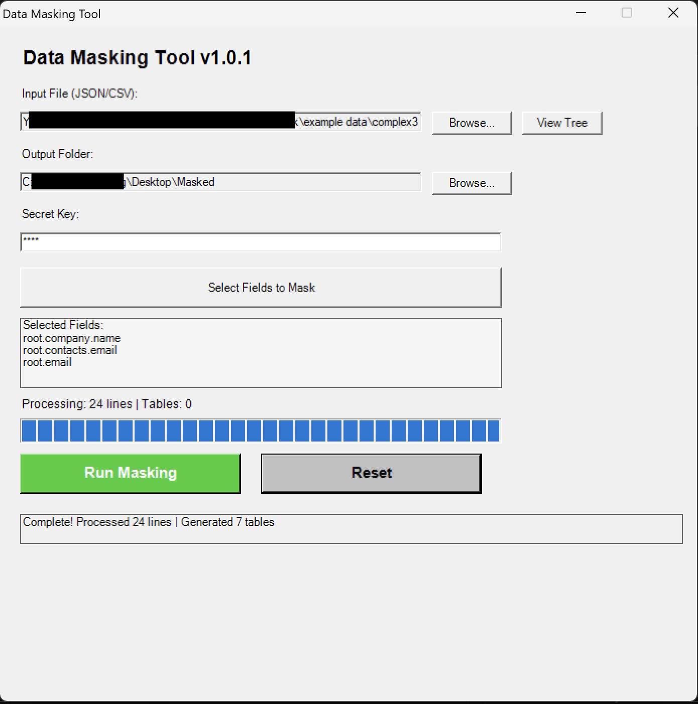

# Data Masking Tool

**Version 1.2.2**

Copyright (c) 2026 Design Effects, LLC

## ⚠️ Disclaimer

This tool was developed through rapid prototyping and intuitive development (vibe coded). While functional and tested, it comes with **limited liability**. Users are responsible for:

- Testing the tool thoroughly with non-production data first
- Validating all masked outputs before use
- Maintaining secure backups of original data
- Storing masking keys securely
- Complying with applicable data protection regulations

**Use at your own risk.**

## Overview

Data Masking Tool is a self-contained PowerShell GUI application that deterministically masks sensitive fields in JSON and CSV files using HMAC-SHA256 hashing. The same input value always produces the same masked output, making it useful for creating consistent test datasets while protecting sensitive information.

### Key Features

- **Deterministic Masking**: Same input = same masked value (using HMAC-SHA256)
- **Multi-Format Support**: Process CSV plus standard, loose, tabular, and envelope JSON formats with identical interface
- **Interactive Field Selection**: Choose which columns/fields to mask via GUI
- **JSON Schema Tree Viewer**: Searchable tree browser for complex nested JSON structures
- **Complete Data Export**: All data exported; only selected fields are masked
- **Audit Trail**: Generate masking key files mapping original → masked values
- **Table Normalization**: Nested JSON automatically normalized into related CSV tables with foreign keys
- **Synthetic Relationship IDs**: Parent-child relationships maintained for manual merging/joining without exposing original IDs
- **Live Status Logging**: Terminal status panel plus capped GUI console log mirror
- **Release Notice & Update Check**: GUI and terminal startup show the no-warranty notice, repo URL, and contact info; the GUI can check GitHub for newer releases or tags
- **Replication Bundle**: Auto-generated replay script plus matching `DataMaskingTool.ps1` source copy for consistent reruns
- **Portable Single EXE**: Fully self-contained executable with zero external dependencies

## Windows Program Requirements

- **Windows 7** or later
- **PowerShell 3.0+**
- **.NET Framework 4.5+**
- **ps2exe module** (for building EXE only)

## Windows Installation & Deployment

### Option 1: PowerShell Script (Direct Execution)

1. Keep only these files:

   - `DataMaskingTool.ps1`
2. Run in PowerShell:

   ```powershell
   Set-ExecutionPolicy -ExecutionPolicy Bypass -Scope Process
   .\DataMaskingTool.ps1
   ```

### Option 2: Batch File Launcher

1. Keep only:

   - `DataMaskingTool.ps1`
   - `launch.bat`
2. Double-click `launch.bat` to start the GUI

Avoids manual execution policy configuration.

### Option 3: Standalone EXE (Fully Portable)

1. Build the EXE:

   ```powershell
   .\Build.ps1 -BuildEXE
   ```
2. Copy only `DataMaskingTool.exe` from the `build/exe/` folder
3. Double-click `DataMaskingTool.exe` on any Windows machine

No PowerShell, installation, or configuration needed.

_Note: Screenshots below are from earlier builds and do not exactly match the current version, but the core functionality and UI flow remain consistent._



## Windows Usage

### Basic Workflow

```
1. Launch Tool
   ↓
2. Select Input File (JSON or CSV)
   ↓
3. View Schema (Optional: for JSON files)
   ↓
4. Select Fields to Mask
   ↓
5. Enter Secret Key
   ↓
6. Run Masking
   ↓
7. Review Output Files
```

### Detailed Steps

#### 1. Launch the Application

**PowerShell:**

```powershell
.\DataMaskingTool.ps1
```

**Batch File:**

```batch
launch.bat
```

**EXE:**

```
Double-click DataMaskingTool.exe
```

Main application window:



#### 2. Select Input File

Click "Browse..." next to "Input File (JSON/CSV)" and choose your data file.

**Supported Formats:**

- `*.json` - JSON objects, arrays of objects, Socrata exports, NDJSON/JSON Lines, loose or concatenated JSON objects, API envelopes, GeoJSON FeatureCollections, and header-row array JSON
- `*.csv` - CSV files with headers

Supported JSON shapes include:

- Standard object or array-of-object JSON
- Socrata exports with `meta.view.columns` and row-array `data`
- NDJSON / JSON Lines with one object per line
- Concatenated or comma-separated loose JSON objects
- API envelopes where records are under `data`, `results`, `items`, or `records`
- GeoJSON `FeatureCollection.features`
- Top-level array-of-arrays where the first row contains column names

#### 3. View JSON Schema (Optional)

For JSON files only: Click "View Tree" to browse the schema structure with search functionality.

#### 4. Select Fields to Mask

Click "Select Fields to Mask" to open the field selection dialog.

**For JSON Files:**

- Shows all nested field paths (e.g., `root.user.email`, `root.address.city`)
- Shows tabular JSON column paths for Socrata and header-row array files
- PowerShell internal properties are auto-filtered
- Check boxes for sensitive fields

**For CSV Files:**

- Shows all column names
- Check boxes for columns containing sensitive data

Example field selection dialog:



#### 5. Enter Secret Key

Enter a strong, memorable secret key. This key:

- Determines the masked output values
- Must remain consistent for replication and merging
- Should be stored securely

**Example keys:**

```
MyCompany_TestEnv_Q2024
SecretKey_PII_Masking_V1
```

#### 6. Run Masking

Click "Run Masking" to process the file.

#### 7. Review Output

Output files are saved to your chosen output folder.

Completed run example:



## Output Files

### CSV Files (All Data)

**data.csv** - Complete dataset with selected fields masked and all others intact

```csv
id,name,email,phone,department
1,John Doe,ABC123XYZ,DEF456GHI,Sales
2,Jane Smith,JKL789MNO,PQR012STU,Marketing
```

**Additional normalized tables** (e.g., user.csv, address.csv, contact.csv)

- Generated from nested JSON structures
- Include foreign key relationships (root_id, user_id, address_id, etc.)
- Usable for manual SQL/Excel JOIN operations
- Relationship IDs are generated by the tool from table structure and row sequence, not from source values. They preserve joins between exported tables even when original ID fields are masked, and they do not reveal masked source identifiers.

### Masking Key

**masking_key.csv** - Complete mapping of original → masked values with field names

```csv
Original,Masked,Field
john.doe@company.com,ABC123XYZ,email
jane.smith@company.com,JKL789MNO,email
555-1234,DEF456GHI,phone
```

Uses for this file:

- Verify masking consistency
- Troubleshoot data issues
- Create reverse lookups (if needed)
- Audit trail of what was masked

### JSON Export (JSON Input Only)

**<filename>_masked.json** - Full JSON with original structure preserved, only selected fields masked

For NDJSON/loose JSON inputs, the masked record output is written as `<filename>_masked.ndjson`. Socrata JSON also produces a fast `data.csv` export using the source column names.

```json
[
  {
    "id": 1,
    "name": "John Doe",
    "email": "ABC123XYZ",
    "phone": "DEF456GHI",
    "address": {
      "street": "123 Main St",
      "city": "Springfield"
    }
  }
]
```

### Replication Script

**replicate_masking.ps1** - Auto-generated replay wrapper for the masking run

Each masking run writes two replication files into the output folder:

- `replicate_masking.ps1` - Small wrapper script that stores the selected fields, secret key, original input path, and output defaults
- `DataMaskingTool.ps1` - Matching tool source exported by the app/EXE so the wrapper can reuse the same masking implementation

The wrapper loads the local `DataMaskingTool.ps1` copy without opening the GUI, then calls `Invoke-Masking`. This avoids maintaining duplicate masking logic inside the replication script.

Usage:

```powershell
# Replay the original input path saved by the GUI run
.\replicate_masking.ps1

# Replay against a moved or replacement input file
.\replicate_masking.ps1 -InputFile "new_data.json"

# Or with custom parameters:
.\replicate_masking.ps1 -InputFile ".\data.csv" -OutputFolder ".\masked-output" -SecretKey "MyKey"
```

The output folder is self-contained for replay as long as `replicate_masking.ps1` and `DataMaskingTool.ps1` stay together. If the remembered original input file has moved, pass `-InputFile` with the new path.

The generated scripts include no-warranty, copyright, and GitHub source-reference comments. `DataMaskingTool.ps1` can also be found at:

```text
https://github.com/hedbergec/flatandmask/blob/main/DataMaskingTool.ps1
```

This process ensures new data is masked with identical values and table structure.

## Windows Regression Testing

Run the full local regression suite with:

```powershell
.\testing scripts\run-all-tests.ps1 -Clean
```

The full end-to-end run can take a long time, especially when replication replay is enabled for the larger bundled JSON datasets. For release checks, expect the complete suite to run well over an hour on some machines. When resuming after a timeout or working on one data fixture, run only the affected data-specific scenarios:

```powershell
.\testing scripts\run-all-tests.ps1 -ScenarioName nypd-officer-profile-json
.\testing scripts\run-all-tests.ps1 -ScenarioName test-data-json,test-ndjson
.\testing scripts\run-all-tests.ps1 -ListScenarios
```

The all-tests runner uses a fixed regression key, reads the current version from `Build.ps1`, and writes artifacts under:

```text
test_output\regression\<version>\
```

For the current build, outputs are saved under `test_output\regression\1.2.2\`.

This test flow masks all bundled example data plus core synthetic fixtures, including:

- Simple and complex JSON examples
- Synthetic HR JSON files, including `synthetic_hr_dataset_with_role_dates.json` and `large_hr_dataset_approx_10mb.json`
- City of London CSV examples
- NYPD officer profile CSV and JSON examples
- NDJSON, concatenated JSON, envelope JSON, GeoJSON, header-array JSON, and Socrata-style JSON fixtures

It verifies that:

- `masking_key.csv` contains the expected original-to-masked mappings
- Masked JSON matches the original JSON except for approved masked fields
- Generated table CSVs match the original flattened data except for approved masked fields
- CSV regression runs use only the first 250 rows of each fixture to keep runs fast and repeatable
- Real-tool scenarios produce non-empty `data.csv`, masked JSON/NDJSON where applicable, and expected masking-key fields

The run also writes `artifact-manifest.json`, which records output files and SHA-256 hashes for future comparisons.

To compare a new version against an older saved run:

```powershell
.\testing scripts\run-all-tests.ps1 -Clean -CompareToRoot .\test_output\regression\1.1.1
```

That writes `artifact-comparison.json` in the new version's output folder and lists added, removed, or changed artifacts.

For a smaller focused regression pass, run:

```powershell
.\testing scripts\run-test-masking.ps1 -Clean -MaxCsvRows 250
```

## CSV-Specific Functionality

### Field Selection

Interactive dialog shows all CSV column names. Select any combination of columns to mask.

### Selective Masking

Only checked columns are masked. All other columns are exported unchanged.

### Complete Export

Entire dataset exported as CSV with all original rows. Masked columns contain hash values instead of original data.

### Deterministic Output

Same secret key + same CSV = identical masked values every time. Allows dataset replication and merging.

### Masking Key for CSV

Complete mapping of all masked values created, including field name for each masked value.

### Table Normalization

CSV data is processed through normalization logic:

- Flat CSV stays as single table: `data.csv`
- Generates `masking_key.csv` with all original→masked mappings
- Generates `replicate_masking.ps1` plus the matching `DataMaskingTool.ps1` replay dependency

### Replication for CSV

Auto-generated `replicate_masking.ps1` can re-run the same masking on the original CSV path or on a replacement CSV file:

- Uses same secret key for consistent values
- Applies same field selections
- Outputs same structure
- Uses the local `DataMaskingTool.ps1` copy saved in the output folder

### Merging Masked CSVs

When running replication:

- Secret key determines masked values (deterministic)
- Same input produces same output
- You can safely merge multiple masked datasets with consistent IDs
- Export all tables from replication for JOIN operations

## Examples

### Example 1: Mask Customer PII in CSV

**Input:** `customers.csv`

```csv
customer_id,name,email,phone,signup_date
101,Alice Johnson,alice@mail.com,555-0001,2024-01-15
102,Bob Smith,bob@mail.com,555-0002,2024-02-20
```

**Steps:**

1. Launch tool
2. Select `customers.csv`
3. Select fields: `email`, `phone`
4. Enter key: `TestMask_2024`
5. Click Run

**Output:** `data.csv`

```csv
customer_id,name,email,phone,signup_date
101,Alice Johnson,KmF7JxQpL2,NmPqRsTu,2024-01-15
102,Bob Smith,VwXyZaBcD,EfGhIjKl,2024-02-20
```

**Output:** `masking_key.csv`

```csv
Original,Masked,Field
alice@mail.com,KmF7JxQpL2,email
bob@mail.com,VwXyZaBcD,email
555-0001,NmPqRsTu,phone
555-0002,EfGhIjKl,phone
```

### Example 2: Mask Nested JSON with Tables

**Input:** `users.json`

```json
[
  {
    "id": 1,
    "profile": {
      "name": "Charlie Brown",
      "email": "charlie@example.com"
    },
    "contact": {
      "phone": "555-0003",
      "address": "456 Oak Ave"
    }
  }
]
```

**Selected fields:** `root.profile.email`, `root.contact.phone`

**Outputs:**

`data.csv` (normalized root table):

```csv
root_id,id,name,address
abc12345,1,Charlie Brown,456 Oak Ave
```

`profile.csv` (nested profile table):

```csv
root_id,profile_id,name,email
abc12345,prof1111,Charlie Brown,OpQrStUvWx
```

`contact.csv` (nested contact table):

```csv
root_id,contact_id,phone
abc12345,cont1111,YzAbCdEfGh
```

**Note:** `root_id` in child tables links back to parent for JOIN operations.

### Example 3: Replication with Consistent IDs

After initial masking with secret key `TestMask_2024`:

```powershell
# Run on new data with same key = same masked values
.\replicate_masking.ps1 -InputFile "new_customers.csv" -SecretKey "TestMask_2024"

# Or replay the original input path remembered by the generated script
.\replicate_masking.ps1
```

Results:

- `alice@mail.com` always masks to `KmF7JxQpL2`
- Same deterministic IDs generated
- Safe to merge multiple masked datasets

## Merging Masked Data with IDs

The tool generates usable IDs for manual merging:

**Key Features:**

- Each table gets a unique ID column (`root_id`, `user_id`, `address_id`, etc.)
- Parent-child relationships maintained through foreign key IDs
- IDs are deterministic (same input + same key = same ID)
- IDs enable SQL or Excel JOIN operations
- Cross-reference child tables back to parent using ID columns

**Manual Merge Example:**

```sql
SELECT d.*, p.email, c.phone
FROM data d
LEFT JOIN profile p ON d.root_id = p.root_id
LEFT JOIN contact c ON d.root_id = c.root_id
```

## Security Considerations

⚠️ **Important:**

1. **Secret Keys**: Treat like passwords. Store securely (encrypted password manager, secure vault, etc.)
2. **Masking Keys**: The `masking_key.csv` file enables reverse-lookup. Store securely or delete after verification.
3. **Original Data**: Keep backups. Masking is irreversible without key mappings.
4. **Shared Environments**: Run on secure, isolated systems when processing real PII.
5. **Deterministic Nature**: Same values always produce same masks. Patterns may be identifiable.
6. **Compliance**: Ensure use complies with GDPR, CCPA, HIPAA, or other applicable regulations.

## Troubleshooting

### "PowerShell execution policy" Error

**Solution - Temporary:**

```powershell
Set-ExecutionPolicy -ExecutionPolicy Bypass -Scope Process
.\DataMaskingTool.ps1
```

**Solution - Persistent:**

```powershell
Set-ExecutionPolicy -ExecutionPolicy RemoteSigned -Scope CurrentUser
```

### "No fields selected" But Tool Ran

**Cause:** Selection dialog was canceled

**Solution:** Click "Select Fields to Mask" again and check boxes.

### Output Files Are Empty

**Causes:**

- Input file format issue or invalid JSON/CSV
- No fields selected for masking
- Input file locked by another program

**Solutions:**

1. Verify input file is valid JSON/CSV
2. Ensure at least one field is selected
3. Close other programs using the file

### EXE Won't Launch

**Cause:** Missing dependencies (shouldn't happen with consolidated version)

**Solution:** Use the PowerShell script or batch file instead.

## Building the Windows Program

### Prerequisites

```powershell
Install-Module -Name ps2exe -Force
```

### Build Command

```powershell
.\Build.ps1 -BuildEXE
```

Outputs:

- `build/dist/` - PowerShell portable version
- `build/exe/` - Standalone EXE (fully portable)

## Files Structure

**Minimal deployment:**

```
DataMaskingTool.exe              # Portable, no dependencies
```

**Or with script:**

```
DataMaskingTool.ps1              # Main script
launch.bat                        # Batch launcher (optional)
```

## R Implementation (`JsonCSVMaskr`)

The repository also includes an R package in `Rpackage/` that mirrors the PowerShell masking engine and provides both scripted and Shiny GUI workflows on Windows, macOS, and Linux.

### R Requirements

- R 4.x
- Packages: `digest`, `jsonlite`, `shiny`, `shinyFiles`
- `roxygen2` is only needed when regenerating help files

### R Installation

Install from GitHub with `remotes`:

```r
install.packages("remotes")
remotes::install_github("hedbergec/flatandmask", subdir = "Rpackage", dependencies = TRUE)
```

Or install with `devtools`:

```r
install.packages("devtools")
devtools::install_github("hedbergec/flatandmask", subdir = "Rpackage", dependencies = TRUE)
```

On Windows, install Rtools from `https://cran.r-project.org/bin/windows/Rtools/` if R asks for build tools. The package is pure R, so most users will receive binary dependencies and will not need a compiler.

Install from a downloaded package artifact after downloading the `.zip` or `.tar.gz` file from a release or from `build/Rpackage/`:

```r
# Install runtime dependencies first
install.packages(c("digest", "jsonlite", "shiny", "shinyFiles"))

# Windows binary package
install.packages("JsonCSVMaskr_0.1.0.zip", repos = NULL, type = "win.binary")

# Source package on Windows, macOS, or Linux
install.packages("JsonCSVMaskr_0.1.0.tar.gz", repos = NULL, type = "source")
```

Use the actual downloaded file path if the package artifact is not in the current R working directory:

```r
install.packages("C:/Users/you/Downloads/JsonCSVMaskr_0.1.0.zip", repos = NULL, type = "win.binary")
install.packages("~/Downloads/JsonCSVMaskr_0.1.0.tar.gz", repos = NULL, type = "source")
```

Install from a local checkout:

```r
install.packages("Rpackage", repos = NULL, type = "source")
```

Or from a terminal in the repository root:

```bash
R CMD INSTALL Rpackage
```

### R Shiny Workflow

Launch the R Shiny interface:

```r
library(JsonCSVMaskr)
run_datamaskr()
```

When the package loads, it prints the same no-warranty, repository, and contact notice shown in the Windows GUI.

The Shiny app opens in a browser. The default output folder is `~/Documents/MASKED`, which resolves to the current user's Documents folder on Windows, macOS, and Linux. The GUI uses local filesystem Browse dialogs when run locally, so generated R replication scripts remember real input/output paths rather than Shiny upload temp paths.

R GUI workflow:

1. On `Setup`, browse to a JSON or CSV input file.
2. Leave the output folder as `~/Documents/MASKED` or choose another folder.
3. Enter a secret key.
4. Go to `Fields` and select fields to mask.
5. Go to `Run` and click `Run Masking`.
6. Review status, console log, and output file list.

### R Scripted Workflow

Scripted masking uses `datamaskr()`:

```r
library(JsonCSVMaskr)

# JSON example
datamaskr(
  input_file = "your-data.json",
  output_folder = "~/Documents/MASKED/json-results",
  secret_key = "your-secret-key",
  mask_fields = c("root.name", "root.email")
)

# CSV example
datamaskr(
  input_file = "your-data.csv",
  output_folder = "~/Documents/MASKED/csv-results",
  secret_key = "your-secret-key",
  mask_fields = c("Name", "Email")
)
```

List fields before choosing what to mask:

```r
get_json_fields("your-data.json")
get_csv_fields("your-data.csv")
```

For examples using the bundled data in this repository:

```r
# Using repository example data
datamaskr(
  input_file = "example data/sample.json",
  output_folder = "example output/r-sample-json",
  secret_key = "example-key",
  mask_fields = c("root.name", "root.email")
)

get_json_fields("example data/sample.json")
```

`invoke_masking()` remains available as a compatibility alias for the PowerShell-style function name:

```r
invoke_masking(
  input_file = "your-data.csv",
  output_folder = "~/Documents/MASKED/invoke-results",
  secret_key = "your-secret-key",
  mask_fields = c("Name")
)
```

Each R run writes `replicate_masking.R` beside the outputs. Open it in R and run it, or run:

```bash
Rscript path/to/replicate_masking.R
```

The generated script loads `JsonCSVMaskr`, remembers the original input/output paths, secret key, and selected fields, and can be edited to point at a moved or replacement input file.

### R Documentation

The R package includes a LaTeX/Sweave vignette rendered from the bundled sample JSON data:

```r
vignette("jsoncsvmaskr-usage", package = "JsonCSVMaskr")
```

In this repository, the source is `Rpackage/vignettes/jsoncsvmaskr-usage.Rnw` and the rendered PDF is `Rpackage/inst/doc/jsoncsvmaskr-usage.pdf`.

The package includes roxygen-generated help files. Useful entry points:

```r
?datamaskr
?get_json_fields
?get_csv_fields
?run_datamaskr
?masking_helpers
?json_helpers
?pipeline_helpers
```

### Building the R Package

Build and check from the repository root:

```bash
R CMD build Rpackage
R CMD check JsonCSVMaskr_0.1.0.tar.gz --no-manual
```

On Windows with R installed and available on `PATH`, build the `JsonCSVMaskr` R package artifacts with:

```powershell
.\Build.ps1 -BuildRPackage
```

If R is installed but not on `PATH`, temporarily prepend its `bin\x64` folder before running the build:

```powershell
$env:PATH = "C:\Program Files (x86)\R\R-4.6.0\bin\x64;$env:PATH"
.\Build.ps1 -BuildRPackage
```

That writes R package artifacts under:

```text
build\Rpackage\
```

Expected files:

- `JsonCSVMaskr_<version>.tar.gz` - R source package
- `JsonCSVMaskr_<version>.zip` - Windows binary package produced by `R CMD INSTALL --build`

To build only the R package artifacts and skip the EXE step:

```powershell
.\Build.ps1 -BuildEXE:$false -BuildRPackage
```

### R Package Fixture Validation

The R package has a fixture validation script that runs `datamaskr()` against the bundled example and test data, then compares the R outputs with the checked-in PowerShell example, smoke, and regression outputs.

From the repository root:

```bash
R CMD INSTALL --library=/tmp/jsoncsvmaskr-lib Rpackage
R_LIBS=/tmp/jsoncsvmaskr-lib Rscript Rpackage/tools/validate-fixtures.R . /tmp/jsoncsvmaskr-fixtures
```

The validation covers CSV, ordinary JSON, loose/NDJSON, concatenated JSON, envelope JSON, GeoJSON, header-array JSON, Socrata JSON, large HR JSON, City of London CSV examples, NYPD CSV/Socrata examples, and a case-sensitive value fixture.

The script accepts an optional scenario-name regular expression as the fourth argument for focused runs:

```bash
R_LIBS=/tmp/jsoncsvmaskr-lib Rscript Rpackage/tools/validate-fixtures.R . /tmp/jsoncsvmaskr-fixtures testkey123 'socrata|nypd'
```

### Testing R Against Windows Output

For R-vs-Windows correspondence checks, first generate fresh Windows PowerShell outputs with the current `DataMaskingTool.ps1`, then pass that output root as the fifth validator argument. The validator requires a matching Windows scenario output in this mode and uses the supplied secret for all compared scenarios:

```powershell
.\testing scripts\test-masking-tool.ps1 -OutputRoot .\test_output\ps_correspondence_probe -SkipReplicationTests -Clean
Rscript Rpackage\tools\validate-fixtures.R . .\test_output\r_correspondence_probe testkey123 '.*' .\test_output\ps_correspondence_probe
```

That run confirms the R implementation and Windows program produce corresponding masked values, masking keys, normalized CSV tables, and masked JSON or NDJSON outputs across the bundled fixture set. Use a narrower scenario pattern for targeted checks:

```powershell
.\testing scripts\test-masking-tool.ps1 -OutputRoot .\test_output\ps_correspondence_probe -SkipReplicationTests -Clean -ScenarioName nypd-officer-profile-json
Rscript Rpackage\tools\validate-fixtures.R . .\test_output\r_correspondence_probe testkey123 'nypd-officer-profile-json' .\test_output\ps_correspondence_probe
```

## Change Log

- **v1.2.2** - Fixed PowerShell masking to preserve exact case-sensitive value identity in line with the R package, added a case-sensitive regression fixture, tightened masking-key HMAC assertions, and confirmed R/PowerShell correspondence across all bundled test and example data
- **v1.2.1** - Simplified replication scripts into wrapper scripts that reuse the matching `DataMaskingTool.ps1`, automatically export that source copy beside each replay script, remember the original input path for no-argument replay, improve replication error messages, and make build signing conditional on version increases
- **v1.2.0** - Added staged GUI progress/status reporting, a capped 100-line GUI log mirror, chunked JSON load progress, more accurate nested JSON progress and table estimates, and documentation for synthetic relationship IDs that preserve joins without exposing original IDs
- **v1.1.2** - Added no-warranty/repository/contact notice to the GUI and terminal startup, GUI buttons to open the repo and check GitHub for updates, deterministic table row IDs, and expanded regression coverage
- **v1.1.0** - Added optimized Socrata JSON processing, NDJSON/loose JSON, envelope JSON, GeoJSON, header-array JSON support, and a five-line live progress panel
- **v1.0.3** - Updated release version
- **v1.0.1** - Consolidated single file, JSON tree viewer, complete CSV masking, table normalization, deterministic IDs for merging
- **v1.0.0** - Initial multi-file release

## Support & Feedback

This tool was developed as a rapid prototype. For issues:

1. Test with sample data first
2. Verify all input files are valid JSON/CSV
3. Check the Troubleshooting section above
4. Validate output against input before production use

## License & Liability

This software is provided "as-is" with no warranty. Use at your own risk. The authors are not liable for any data loss, corruption, or other issues arising from use of this tool.
